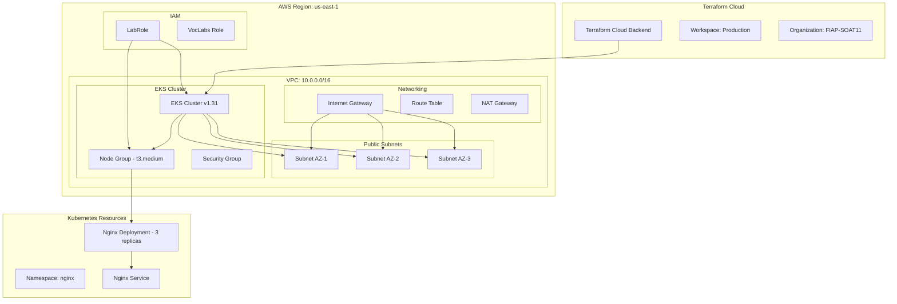

# ⚡ POC Terraform Cloud - EKS Infrastructure

<div align="center">

[](https://www.terraform.io/)
[](https://aws.amazon.com/)
[](https://kubernetes.io/)
[](https://cloud.hashicorp.com/products/terraform)
[](LICENSE)

</div>

Projeto de demonstração (POC) para implementação de infraestrutura como código utilizando Terraform Cloud com cluster Amazon EKS, desenvolvido como parte de estudos práticos de DevOps e Cloud Computing.

<div align="center">
  <a href="#visao-geral">Visão Geral</a> •
  <a href="#arquitetura">Arquitetura</a> •
  <a href="#tecnologias">Tecnologias</a> •
  <a href="#estrutura-infraestrutura">Estrutura da Infraestrutura</a> •
  <a href="#instalacao-e-uso">Instalação e Uso</a> •
  <a href="#estrutura-do-projeto">Estrutura do Projeto</a> •
  <a href="#configuracao">Configuração</a> •
  <a href="#recursos-provisionados">Recursos Provisionados</a> •
  <a href="#resolucao-de-problemas">Resolução de Problemas</a> •
  <a href="#contribuicao-e-licenca">Contribuição e Licença</a>
</div>

<h2 id="visao-geral">📋 Visão Geral</h2>

Este projeto demonstra a implementação de uma infraestrutura completa na AWS utilizando Terraform Cloud como backend, focando em um cluster Amazon EKS (Elastic Kubernetes Service) com deployment de aplicações containerizadas. O sistema provisiona uma infraestrutura de rede segura e um cluster Kubernetes gerenciado, seguindo boas práticas de Infrastructure as Code (IaC).

### Principais recursos

- **Cluster EKS Gerenciado**: Amazon EKS versão 1.31 com node groups autoscaling
- **Infraestrutura de Rede**: VPC dedicada com subnets públicas distribuídas em múltiplas AZs
- **Terraform Cloud Backend**: Gerenciamento de estado centralizado e colaborativo
- **Kubernetes Deployments**: Aplicação Nginx containerizada com 3 réplicas
- **Security Groups**: Configuração de segurança para o cluster EKS
- **IAM Integration**: Utilização de roles IAM para autenticação e autorização

<h2 id="arquitetura">🏗️ Arquitetura</h2>

<details>
<summary>Expandir para mais detalhes</summary>

### Diagrama de Arquitetura



### Componentes da Arquitetura

**Terraform Cloud**

- Backend centralizado para gerenciamento de estado
- Workspace dedicado para ambiente de produção
- Integração com organização FIAP-SOAT11

**Rede AWS**

- VPC dedicada com CIDR 10.0.0.0/16
- 3 subnets públicas distribuídas em AZs diferentes
- Internet Gateway para acesso externo
- Route tables configuradas automaticamente

**Cluster EKS**

- Versão Kubernetes 1.31
- Node group com instâncias t3.medium
- Autoscaling configurado (min: 2, max: 3, desired: 2)
- Integração com IAM roles para autenticação

</details>

<h2 id="tecnologias">🔧 Tecnologias</h2>

<details>
<summary>Expandir para mais detalhes</summary>

### Infraestrutura como Código

- **Terraform ~> 1.5**: Ferramenta principal de IaC
- **Terraform Cloud**: Backend remoto e gerenciamento de estado
- **AWS Provider**: Provider oficial da AWS para Terraform
- **Kubectl Provider**: Provider para recursos Kubernetes
- **Kubernetes Provider**: Provider nativo do Terraform para Kubernetes

### Provedores de Nuvem

- **Amazon Web Services (AWS)**: Plataforma de nuvem
  - **EKS**: Elastic Kubernetes Service - serviço gerenciado do Kubernetes
  - **EC2**: Elastic Compute Cloud para worker nodes
  - **VPC**: Virtual Private Cloud para isolamento de rede
  - **IAM**: Identity and Access Management para autenticação

### Orquestração de Containers

- **Kubernetes 1.31**: Plataforma de orquestração de containers
- **Nginx**: Servidor web como aplicação de demonstração
- **kubectl**: Interface de linha de comando para Kubernetes

### Recursos AWS Utilizados

- **aws_eks_cluster**: Cluster Kubernetes gerenciado
- **aws_eks_node_group**: Grupo de worker nodes
- **aws_vpc**: Virtual Private Cloud
- **aws_subnet**: Subnets públicas
- **aws_internet_gateway**: Gateway de internet
- **aws_route_table**: Tabelas de roteamento
- **aws_security_group**: Grupos de segurança

</details>

<h2 id="estrutura-infraestrutura">🏗️ Estrutura da Infraestrutura</h2>

<details>
<summary>Expandir para mais detalhes</summary>

### Componentes de Rede

**VPC (Virtual Private Cloud)**

- CIDR Block: 10.0.0.0/16
- DNS hostnames e DNS support habilitados
- Tags de identificação do projeto

**Subnets Públicas**

- Distribuídas em 3 Availability Zones
- Acesso direto à internet via Internet Gateway
- Configuração automática de IPs públicos

**Connectivity**

- Internet Gateway para acesso externo
- Route Tables configuradas automaticamente
- Security Groups específicos para EKS

### Cluster EKS

**Configuração do Cluster**

- Nome: eks-fiap-aula-terraform
- Versão: 1.31 (Kubernetes)
- Modo de autenticação: API
- Role IAM: LabRole

**Node Group**

- Nome: nodeg-fiap-aula-terraform
- Tipo de instância: t3.medium
- Tamanho do disco: 50GB
- Scaling config: min 2, max 3, desired 2

### Recursos Kubernetes

**Namespace**

- Namespace dedicado: nginx
- Isolamento de recursos da aplicação

**Deployment**

- Aplicação: Nginx 1.25
- Réplicas: 3 pods
- Seletor de labels para alta disponibilidade
- Container port: 80

**Service**

- Exposição do deployment Nginx
- Load balancing entre os pods
- Configuração de portas e seletores

### Providers e Autenticação

**AWS Provider**

- Região padrão: us-east-1
- Autenticação via IAM roles

**Kubectl Provider**

- Conexão direta com cluster EKS
- Token de autenticação automático
- Certificado CA do cluster

**Kubernetes Provider**

- Gerenciamento nativo de recursos K8s
- Integração com EKS endpoint
- Autenticação baseada em tokens

</details>

<h2 id="instalacao-e-uso">🚀 Instalação e Uso</h2>

<details>
<summary>Expandir para mais detalhes</summary>

### Pré-requisitos

- **Terraform**: Versão 1.5 ou superior
- **AWS CLI**: Configurado com credenciais válidas
- **kubectl**: Para gerenciar o cluster Kubernetes
- **Conta Terraform Cloud**: Com workspace configurado
- **Conta AWS**: Com permissões para criar recursos EKS e VPC

### Configuração do Terraform Cloud

#### 1. Criar Organização e Workspace

```bash
# 1. Acesse https://cloud.hashicorp.com/products/terraform
# 2. Crie uma conta ou faça login
# 3. Crie uma organização (ex: FIAP-SOAT11)
# 4. Crie um workspace chamado "Production"
```

#### 2. Configurar Variáveis de Ambiente no Terraform Cloud

No workspace do Terraform Cloud, configure as seguintes variáveis:

```hcl
# Environment Variables (marcar como sensitive)
AWS_ACCESS_KEY_ID = "sua-access-key"
AWS_SECRET_ACCESS_KEY = "sua-secret-key"
AWS_SESSION_TOKEN = "seu-session-token"  # Se usando temporary credentials

# Terraform Variables
projectName = "fiap-aula-terraform"
region_default = "us-east-1"
cidr_vpc = "10.0.0.0/16"
instance_type = "t3.medium"
```

### Configuração das Credenciais AWS

```bash
# 1. Configuração AWS CLI local (para validação)
aws configure

# 2. Verificar configuração atual
aws configure list
aws sts get-caller-identity

# 3. Testar acesso aos serviços necessários
aws eks list-clusters --region us-east-1
aws ec2 describe-vpcs --region us-east-1
```

### Instalação e Execução

```bash
# 1. Clone o repositório
git clone <repository-url>
cd POC-terraform-cloud

# 2. Login no Terraform Cloud
terraform login

# 3. Inicialize o Terraform
terraform init

# 4. Valide a configuração
terraform validate

# 5. Revise o plano de execução
terraform plan

# 6. Aplique as mudanças
terraform apply

# 7. Confirme a aplicação digitando 'yes'
```

### Configuração do kubectl

Após o cluster EKS ser criado:

```bash
# 1. Configurar kubectl para conectar ao cluster
aws eks update-kubeconfig --region us-east-1 --name eks-fiap-aula-terraform

# 2. Verificar conectividade
kubectl get nodes

# 3. Verificar namespaces
kubectl get namespaces

# 4. Verificar deployments
kubectl get deployments -n nginx

# 5. Verificar pods
kubectl get pods -n nginx

# 6. Verificar services
kubectl get services -n nginx
```

### Comandos Úteis para Gerenciamento

```bash
# Terraform
terraform fmt                    # Formatação automática
terraform validate              # Validação de sintaxe
terraform plan                  # Visualizar mudanças
terraform apply                 # Aplicar mudanças
terraform destroy              # Destruir infraestrutura

# Kubernetes
kubectl get all -n nginx        # Todos recursos no namespace
kubectl describe pod <pod-name> -n nginx  # Detalhes do pod
kubectl logs <pod-name> -n nginx          # Logs do pod
kubectl exec -it <pod-name> -n nginx -- /bin/bash  # Acesso ao container

# AWS CLI
aws eks describe-cluster --name eks-fiap-aula-terraform --region us-east-1
aws eks describe-nodegroup --cluster-name eks-fiap-aula-terraform --nodegroup-name nodeg-fiap-aula-terraform --region us-east-1
```

### Customização via Variáveis

Edite as variáveis no Terraform Cloud workspace para personalizar:

```hcl
# No Terraform Cloud - Variables
projectName = "meu-projeto-eks"
instance_type = "t3.large"
cidr_vpc = "172.16.0.0/16"

# Tags personalizadas
tags = {
  Name = "meu-cluster-eks"
  School = "FIAP"
  Environment = "Development"
  Year = "2025"
}
```

</details>

<h2 id="estrutura-do-projeto">📁 Estrutura do Projeto</h2>

<details>
<summary>Expandir para mais detalhes</summary>

```
POC-terraform-cloud/
│
├── backend.tf                 # Configuração do Terraform Cloud backend
├── providers.tf               # Configuração dos providers (AWS, kubectl, kubernetes)
├── vars.tf                    # Definição das variáveis do projeto
├── locals.tf                  # Valores locais e ARNs dos roles IAM
├── data.tf                    # Data sources (caller identity, EKS cluster info)
├── output.tf                  # Outputs do projeto
│
├── vpc.tf                     # Virtual Private Cloud
├── subnet.tf                  # Subnets públicas distribuídas em AZs
├── internet-g.tf              # Internet Gateway
├── route-t.tf                 # Route Tables
├── sg.tf                      # Security Groups
│
├── iam-role.tf                # IAM Roles e policies
├── access-entry.tf            # EKS Access entries
│
├── eks-cluster.tf             # Cluster EKS principal
├── eks-node.tf                # Node group do EKS
│
├── k8s-namespace.tf           # Namespace Kubernetes
├── k8s-deployment.tf          # Deployment da aplicação Nginx
├── k8s-service.tf             # Service para exposição da aplicação
│
├── bucket.tf                  # S3 bucket (se necessário para logs/backups)
├── LICENSE                    # Licença do projeto
└── README.md                  # Documentação principal
```

### Descrição dos Arquivos Principais

#### Configuração Base

- **backend.tf**: Configuração do Terraform Cloud como backend remoto
- **providers.tf**: Configuração dos providers AWS, kubectl e kubernetes
- **vars.tf**: Definição de todas as variáveis do projeto com valores padrão
- **locals.tf**: Valores locais para ARNs dos roles IAM
- **data.tf**: Data sources para obter informações da conta AWS e cluster

#### Infraestrutura de Rede

- **vpc.tf**: Criação da VPC com DNS support habilitado
- **subnet.tf**: Subnets públicas distribuídas em múltiplas AZs
- **internet-g.tf**: Internet Gateway para conectividade externa
- **route-t.tf**: Tabelas de roteamento para as subnets
- **sg.tf**: Security Groups com regras específicas para EKS

#### Cluster EKS

- **eks-cluster.tf**: Configuração principal do cluster EKS
- **eks-node.tf**: Node group com configurações de scaling
- **iam-role.tf**: Roles e policies IAM necessárias
- **access-entry.tf**: Configuração de acesso ao cluster

#### Aplicações Kubernetes

- **k8s-namespace.tf**: Namespace dedicado para a aplicação
- **k8s-deployment.tf**: Deployment do Nginx com 3 réplicas
- **k8s-service.tf**: Service para exposição da aplicação

#### Arquivos de Saída

- **output.tf**: Outputs importantes como endpoint do cluster, VPC ID, etc.

</details>

<h2 id="configuracao">⚙️ Configuração</h2>

<details>
<summary>Expandir para mais detalhes</summary>

### Variáveis de Ambiente

O projeto utiliza as seguintes configurações principais:

#### Variáveis do Projeto (vars.tf)

```hcl
variable "projectName" {
  default = "fiap-aula-terraform"
  description = "Nome base do projeto usado em todos os recursos"
}

variable "region_default" {
  default = "us-east-1"
  description = "Região AWS padrão para todos os recursos"
}

variable "cidr_vpc" {
  default = "10.0.0.0/16"
  description = "CIDR block para a VPC"
}

variable "instance_type" {
  default = "t3.medium"
  description = "Tipo de instância para os worker nodes"
}

variable "tags" {
  default = {
    Name = "fiap-terraform-aula"
    School = "FIAP"
    Environment = "Production"
    Year = "2025"
  }
  description = "Tags aplicadas a todos os recursos"
}
```

#### Valores Locais (locals.tf)

```hcl
locals {
  principalRoleArn = "arn:aws:iam::${data.aws_caller_identity.current.account_id}:role/voclabs"
  labRoleArn = "arn:aws:iam::${data.aws_caller_identity.current.account_id}:role/LabRole"
}
```

### Configuração do Terraform Cloud

#### Backend Configuration (backend.tf)

```hcl
terraform {
  cloud {
    organization = "FIAP-SOAT11"

    workspaces {
      name = "Production"
    }
  }
}
```

#### Configuração no Terraform Cloud Workspace

1. **Environment Variables** (marcar como sensitive):

```bash
AWS_ACCESS_KEY_ID = "sua-access-key"
AWS_SECRET_ACCESS_KEY = "sua-secret-key"
AWS_SESSION_TOKEN = "seu-session-token"  # Para credenciais temporárias
```

2. **Terraform Variables**:

```hcl
projectName = "fiap-aula-terraform"
region_default = "us-east-1"
cidr_vpc = "10.0.0.0/16"
instance_type = "t3.medium"
```

### Configuração dos Providers

#### AWS Provider

```hcl
provider "aws" {
  region = var.region_default
}
```

#### Kubectl Provider

```hcl
provider "kubectl" {
  host                   = data.aws_eks_cluster.cluster.endpoint
  cluster_ca_certificate = base64decode(data.aws_eks_cluster.cluster.certificate_authority[0].data)
  token                  = data.aws_eks_cluster_auth.auth.token
  load_config_file       = false
}
```

#### Kubernetes Provider

```hcl
provider "kubernetes" {
  host                   = data.aws_eks_cluster.cluster.endpoint
  cluster_ca_certificate = base64decode(data.aws_eks_cluster.cluster.certificate_authority[0].data)
  token                  = data.aws_eks_cluster_auth.auth.token
}
```

### Data Sources

#### AWS Account Information

```hcl
data "aws_caller_identity" "current" {}

data "aws_availability_zones" "available" {
  state = "available"
}
```

#### EKS Cluster Information

```hcl
data "aws_eks_cluster" "cluster" {
  name = aws_eks_cluster.cluster.name
}

data "aws_eks_cluster_auth" "auth" {
  name = aws_eks_cluster.cluster.name
}
```

### Personalização Avançada

#### Modificar Configuração do Cluster EKS

```hcl
# Em eks-cluster.tf - modificar versão do Kubernetes
resource "aws_eks_cluster" "cluster" {
  version = "1.32"  # Atualizar versão

  # Adicionar logging
  enabled_cluster_log_types = ["api", "audit", "authenticator"]
}
```

#### Personalizar Node Group

```hcl
# Em eks-node.tf - modificar configurações de scaling
resource "aws_eks_node_group" "node_group" {
  instance_types = ["t3.large"]  # Alterar tipo de instância

  scaling_config {
    desired_size = 3  # Aumentar número de nodes
    max_size     = 5
    min_size     = 3
  }
}
```

#### Adicionar Novos Deployments Kubernetes

```hcl
# Novo arquivo: k8s-app-deployment.tf
resource "kubectl_manifest" "app_deploy" {
  depends_on = [kubectl_manifest.namespace]
  yaml_body = <<YAML
apiVersion: apps/v1
kind: Deployment
metadata:
  name: my-app
  namespace: nginx
spec:
  replicas: 2
  selector:
    matchLabels:
      app: my-app
  template:
    metadata:
      labels:
        app: my-app
    spec:
      containers:
        - name: my-app
          image: httpd:2.4
          ports:
            - containerPort: 80
YAML
}
```

### Configuração de Monitoramento

Para habilitar monitoramento avançado:

```hcl
# Adicionar em vars.tf
variable "enable_monitoring" {
  default = true
  description = "Habilitar monitoramento avançado"
}

# Adicionar ao node group
monitoring = var.enable_monitoring
```

</details>

<h2 id="recursos-provisionados">☁️ Recursos Provisionados</h2>

<details>
<summary>Expandir para mais detalhes</summary>

### Infraestrutura de Rede

#### VPC (Virtual Private Cloud)

- **CIDR Block**: 10.0.0.0/16 (65,536 IPs disponíveis)
- **DNS Support**: Habilitado para resolução de nomes
- **DNS Hostnames**: Habilitado para instâncias EC2
- **Tags**: Identificação do projeto FIAP

#### Subnets Públicas

- **Quantidade**: 3 subnets distribuídas em AZs diferentes
- **Conectividade**: Acesso direto à internet via Internet Gateway
- **Redundância**: Alta disponibilidade através de múltiplas zonas

#### Connectivity Resources

- **Internet Gateway**: Acesso bidirecional à internet
- **Route Tables**: Roteamento automático para internet
- **Security Groups**: Regras específicas para comunicação EKS

### Cluster Amazon EKS

#### Cluster Principal

- **Nome**: eks-fiap-aula-terraform
- **Versão**: Kubernetes 1.31
- **Modo de Autenticação**: API
- **Endpoint**: Acesso via API Kubernetes
- **Role IAM**: LabRole para operações do cluster

#### Node Group

- **Nome**: nodeg-fiap-aula-terraform
- **Tipo de Instância**: t3.medium (2 vCPUs, 4GB RAM)
- **Disco**: 50GB SSD por node
- **Scaling Configuration**:
  - Mínimo: 2 nodes
  - Máximo: 3 nodes
  - Desejado: 2 nodes
- **Update Strategy**: Max unavailable = 1

### Aplicações Kubernetes

#### Namespace

- **Nome**: nginx
- **Isolamento**: Recursos dedicados para aplicação
- **Labels**: Identificação do projeto

#### Nginx Deployment

- **Imagem**: nginx:1.25
- **Réplicas**: 3 pods para alta disponibilidade
- **Port**: 80 (HTTP)
- **Seletor**: app=nginx para service discovery
- **Resource Limits**: Configuráveis via deployment

#### Nginx Service

- **Tipo**: ClusterIP (padrão)
- **Port Mapping**: 80:80
- **Seletor**: app=nginx
- **Load Balancing**: Automático entre os 3 pods

### Recursos IAM

#### Roles Utilizadas

- **LabRole**: Role principal para cluster e node group
- **VocLabs**: Role de princípio para acesso

#### Access Policies

- **EKS Cluster Admin Policy**: Administração completa do cluster
- **Node Group Policies**: Permissões para worker nodes

### Resumo de Custos Estimados

> **Nota**: Os custos podem variar baseado no uso, região e tempo de execução

#### EKS Cluster

- **Cluster Management**: ~$72/mês (fixo)
- **Data Processing**: Baseado no volume de dados

#### EC2 Instances (Node Group)

- **2x t3.medium**: ~$60.62/mês
- **Storage EBS**: ~$10/mês (50GB x 2 nodes)

#### Networking

- **NAT Gateway**: ~$32.40/mês (se habilitado)
- **Data Transfer**: Varia baseado no tráfego

#### Estimativa Total

- **Mínimo**: ~$143/mês (sem NAT Gateway)
- **Completo**: ~$175/mês (com todos recursos)

### Monitoramento e Observabilidade

#### CloudWatch Integration

- **Cluster Metrics**: CPU, Memória, Network
- **Node Metrics**: Saúde dos worker nodes
- **Pod Metrics**: Status das aplicações

#### Comandos de Verificação

```bash
# Status do cluster
kubectl cluster-info

# Nodes do cluster
kubectl get nodes -o wide

# Recursos no namespace
kubectl get all -n nginx

# Logs das aplicações
kubectl logs -l app=nginx -n nginx

# Describe recursos
kubectl describe deployment nginx-deploy -n nginx
```

### Backup e Disaster Recovery

#### State Management

- **Backend**: Terraform Cloud (versionado automaticamente)
- **Encryption**: Estado encriptado no Terraform Cloud
- **Access Control**: Baseado em roles do Terraform Cloud

#### Cluster Backup

- **ETCD**: Backup automático pelo EKS
- **Application Data**: Responsabilidade da aplicação
- **Configuration**: Versionado via Git + Terraform

</details>

<h2 id="resolucao-de-problemas">🔍 Resolução de Problemas</h2>

<details>
<summary>Expandir para mais detalhes</summary>

### Problemas Comuns

#### 1. Erro de Autenticação AWS no Terraform Cloud

```
Error: error configuring Terraform AWS Provider: no valid credential sources
```

**Solução:**

```bash
# No Terraform Cloud workspace, configure as variáveis de ambiente:
# (Marcar como "Sensitive")
AWS_ACCESS_KEY_ID = "sua-access-key"
AWS_SECRET_ACCESS_KEY = "sua-secret-key"
AWS_SESSION_TOKEN = "seu-session-token"  # Para credenciais temporárias

# Verificar credenciais localmente primeiro:
aws sts get-caller-identity
aws eks list-clusters --region us-east-1
```

#### 2. Erro de Permissões EKS

```
Error: AccessDenied: User is not authorized to perform: eks:CreateCluster
```

**Solução:**
Certifique-se de que o usuário/role IAM possui as seguintes permissões:

```json
{
  "Version": "2012-10-17",
  "Statement": [
    {
      "Effect": "Allow",
      "Action": ["eks:*", "ec2:*", "iam:ListRoles", "iam:PassRole"],
      "Resource": "*"
    }
  ]
}
```

#### 3. Erro de kubectl Após Criação do Cluster

```
error: You must be logged in to the server (Unauthorized)
```

**Solução:**

```bash
# Atualizar configuração do kubectl
aws eks update-kubeconfig --region us-east-1 --name eks-fiap-aula-terraform

# Verificar contexto atual
kubectl config current-context

# Verificar acesso
kubectl auth can-i get pods --all-namespaces
```

#### 4. Node Group Falha ao Criar

```
Error: InvalidParameter: The provided role doesn't have the Amazon EKS Worker Node IAM Policy
```

**Solução:**
Verificar se a role LabRole possui as policies necessárias:

```bash
# Verificar policies da role
aws iam list-attached-role-policies --role-name LabRole

# As seguintes policies devem estar anexadas:
# - AmazonEKSWorkerNodePolicy
# - AmazonEKS_CNI_Policy
# - AmazonEC2ContainerRegistryReadOnly
```

#### 5. Pods em Estado Pending

```bash
# Verificar status dos pods
kubectl get pods -n nginx
# NAME                            READY   STATUS    RESTARTS   AGE
# nginx-deploy-xxx                0/1     Pending   0          5m
```

**Solução:**

```bash
# Verificar eventos do pod
kubectl describe pod <pod-name> -n nginx

# Verificar recursos disponíveis nos nodes
kubectl top nodes

# Verificar node conditions
kubectl describe nodes

# Verificar se há taints nos nodes
kubectl get nodes -o json | jq '.items[].spec.taints'
```

#### 6. Service Não Acessível

```bash
# Service criado mas não acessível
kubectl get svc -n nginx
```

**Solução:**

```bash
# Verificar endpoints do service
kubectl get endpoints -n nginx

# Verificar se os pods têm as labels corretas
kubectl get pods -n nginx --show-labels

# Testar conectividade interna
kubectl run test-pod --image=busybox --rm -it -- wget -qO- http://nginx-service.nginx.svc.cluster.local
```

### Debugging

#### Habilitar Logs Detalhados do Terraform

```bash
# Localmente (se necessário)
export TF_LOG=DEBUG
terraform plan

# No Terraform Cloud:
# Variables -> Add variable
# Key: TF_LOG
# Value: DEBUG
# Category: Environment variable
```

#### Verificar Estado do Terraform

```bash
# Listar recursos no estado
terraform state list

# Mostrar detalhes de um recurso
terraform state show aws_eks_cluster.cluster

# Verificar outputs
terraform output
```

#### Debugging Kubernetes

```bash
# Verificar logs do sistema
kubectl get events --sort-by=.metadata.creationTimestamp

# Logs de um deployment específico
kubectl logs deployment/nginx-deploy -n nginx

# Verificar configuração do cluster
kubectl cluster-info dump

# Verificar recursos de sistema
kubectl get all -n kube-system
```

#### Verificar Conectividade de Rede

```bash
# Testar DNS interno
kubectl run test-dns --image=busybox --rm -it -- nslookup kubernetes.default

# Verificar service discovery
kubectl run test-svc --image=busybox --rm -it -- nslookup nginx-service.nginx.svc.cluster.local

# Testar conectividade externa
kubectl run test-external --image=busybox --rm -it -- wget -qO- http://google.com
```

### Validação de Configuração

#### Validar Terraform

```bash
terraform validate
terraform fmt -check=true
terraform plan -detailed-exitcode
```

#### Validar Kubernetes

```bash
# Validar manifests (se usando arquivos YAML)
kubectl apply --dry-run=client -f k8s-manifests/

# Verificar API versions
kubectl api-versions

# Verificar recursos disponíveis
kubectl api-resources
```

### Recovery Procedures

#### Em Caso de Estado Corrompido

```bash
# Terraform Cloud automaticamente versiona o estado
# Acesse o workspace no Terraform Cloud -> States -> Previous versions

# Para forçar unlock (cuidado)
terraform force-unlock <lock-id>
```

#### Recrear Recursos Específicos

```bash
# Forçar recreação de um recurso
terraform apply -replace="aws_eks_node_group.node_group"

# Importar recurso existente
terraform import aws_eks_cluster.cluster eks-fiap-aula-terraform
```

#### Backup Manual do Estado

```bash
# Baixar estado atual (se necessário)
terraform state pull > backup-state.json

# Para restaurar (cuidado extremo)
terraform state push backup-state.json
```

</details>

<h2 id="contribuicao-e-licenca">🙏 Contribuição e Licença</h2>

### Guia de Contribuição

Para contribuir com o projeto, siga estas etapas:

#### Branches

- A branch principal de desenvolvimento é a `main`
- Para novas funcionalidades, crie uma branch a partir da `main` seguindo o padrão:
  - `feature/nome-da-funcionalidade`
- Para correções de bugs, use o padrão:
  - `fix/descricao-do-bug`
- Para documentação:
  - `docs/descricao-da-documentacao`
- Para melhorias de infraestrutura:
  - `infra/descricao-da-mudanca`

#### Commits

Siga a convenção [Conventional Commits](https://www.conventionalcommits.org/):

```
<tipo>[escopo opcional]: <descrição>

[corpo opcional]

[rodapé(s) opcional(is)]
```

Exemplos:

- `feat(eks): adiciona suporte para Fargate profiles`
- `fix(networking): corrige configuração de security groups`
- `docs: atualiza README com comandos kubectl`
- `refactor(k8s): melhora estrutura dos manifests`

#### Pull Requests

1. Certifique-se que sua branch está atualizada com a `main`
2. Execute `terraform fmt` e `terraform validate`
3. Teste as mudanças com `terraform plan`
4. Valide recursos Kubernetes com `kubectl apply --dry-run`
5. Faça um pull request para a branch `main`
6. Descreva as alterações realizadas de forma clara
7. Vincule issues relacionadas
8. Aguarde a revisão dos mantenedores

### Padrões de Código

#### Terraform

- Use nomes descritivos para recursos e variáveis
- Mantenha comentários em código complexo
- Utilize `terraform fmt` para formatação consistente
- Implemente validações para variáveis críticas
- Documente outputs dos recursos

#### Kubernetes

- Use namespaces para isolamento de recursos
- Aplique labels consistentes para seleção
- Configure resource limits e requests
- Implemente health checks quando necessário
- Documente configurações específicas

---

### Contribuidores

Este projeto é mantido por:

- [Pedro Ferrarezzo](https://github.com/pedroferrarezzo)

Contribuições são bem-vindas! Veja o [guia de contribuição](#contribuicao-e-licenca) para mais detalhes.

---

### Licença

Este projeto está licenciado sob a licença MIT. Veja o arquivo [LICENSE](LICENSE) para mais detalhes.

---

### Recursos Adicionais

- [Documentação Oficial do Terraform](https://www.terraform.io/docs)
- [AWS Provider Documentation](https://registry.terraform.io/providers/hashicorp/aws/latest/docs)
- [Terraform Cloud Documentation](https://cloud.hashicorp.com/docs/terraform)
- [Amazon EKS User Guide](https://docs.aws.amazon.com/eks/latest/userguide/)
- [Kubernetes Documentation](https://kubernetes.io/docs/)
- [kubectl Reference](https://kubernetes.io/docs/reference/kubectl/)
- [AWS Free Tier](https://aws.amazon.com/free/)
- [AWS Academy](https://www.awsacademy.com/vforcesite/LMS_Login)

---

<div align="center">

**⭐ Se este projeto foi útil, considere dar uma estrela!**

[⬆ Voltar ao topo](#-poc-terraform-cloud---eks-infrastructure)

</div>
